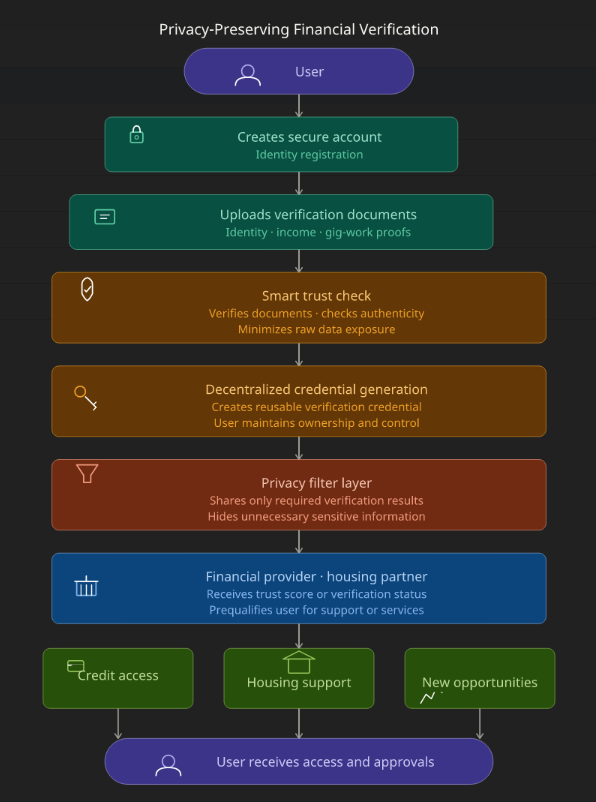

# FinCap Score

Mastercard × The Knowledge House Hackathon 2026

## Problem

Millions of financially responsible individuals are excluded from
financial opportunities because traditional credit systems often fail
to recognize alternative indicators of financial reliability.

## Solution

FinCap Score is a privacy-first onboarding and verification platform
that leverages Web3 concepts to help underserved users demonstrate
financial credibility while maintaining control of their personal data.

## Key Features

- Alternative trust indicators
- Decentralized identity concepts
- Privacy-preserving verification
- Reduced onboarding friction
- Financial inclusion focus

## Architecture

## Demo

(link)[https://fincapscore.lovable.app/]

## Team

Christopher Diaz (Project Lead)
Emmanuel Udah (Technical Lead)
Renee Jackson (Data/Research Lead)
Trenna Johnson (Design/Presentation Lead)
Willie Xu (Documentation Lead)

## Future Development

- Enhanced verification methods
- Financial institution integrations
- Fraud detection capabilities
- Expanded trust indicators
